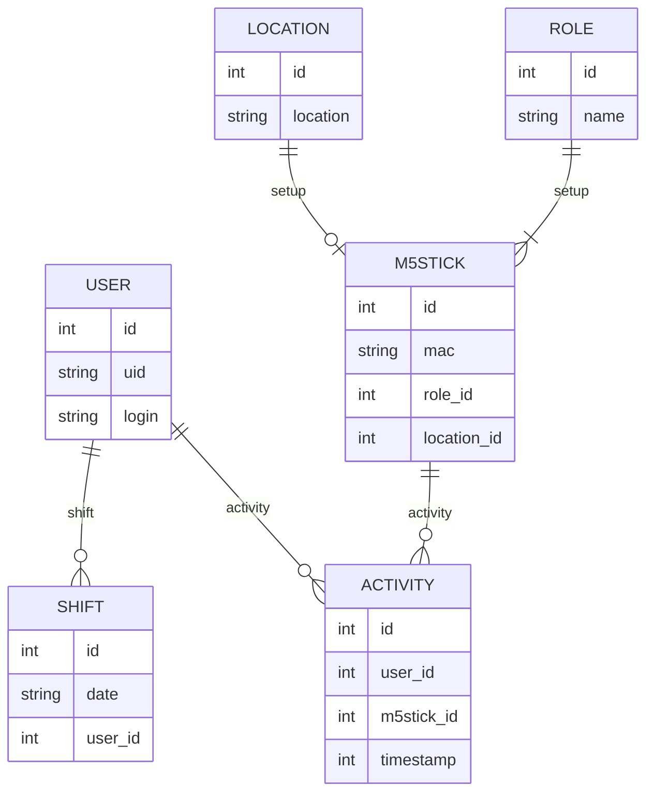

# Tables

```mermaid
erDiagram

    USER ||--o{ SHIFT : shift
    USER ||--o{ ACTIVITY : activity
    USER {
        int id
        string uid
        string login
    }

    SHIFT {
        int id
        string date
        int user_id
    }

    LOCATION ||--o| M5STICK : setup
    LOCATION {
        int id
        string location
    }

    ROLE ||--|{ M5STICK : setup
    ROLE {
        int id
        string name
    }

    M5STICK ||--o{ ACTIVITY : activity
    M5STICK {
        int id
        string mac
        int role_id
        int location_id
    }

    ACTIVITY {
        int id
        int user_id
        int m5stick_id
        int timestamp
    }
```
