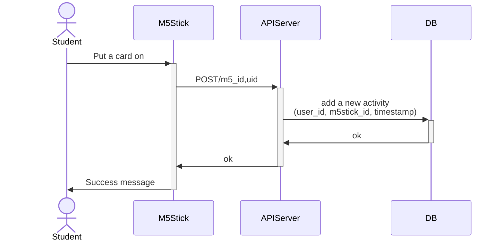

# Add Activities

```mermaid
sequenceDiagram

actor student as Student

participant m5 as M5Stick
participant api as APIServer
participant db as DB

student ->>+ m5: Put a card on
m5 ->>+ api: POST/m5_id,uid
api ->>+ db: add a new activity<br>(user_id, m5stick_id, timestamp)
db ->>- api: ok
api ->>- m5: ok
m5 ->>- student: Success message
```
