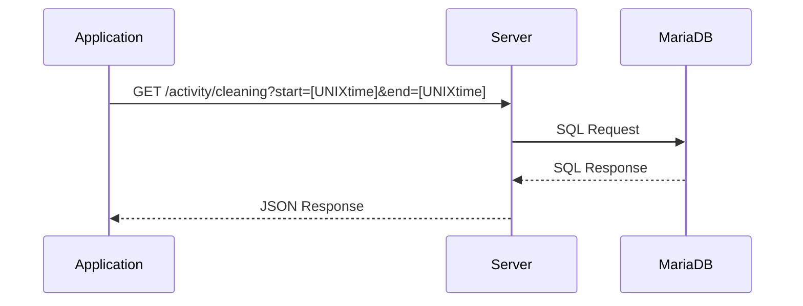

# GetCleaningInfo

```mermaid
sequenceDiagram

participant Application
participant Server
participant MariaDB
Application->>Server: GET /activity/cleaning?start=[UNIXtime]&end=[UNIXtime]
Server->>MariaDB: SQL Request
MariaDB-->>Server: SQL Response
Server-->>Application: JSON Response
```