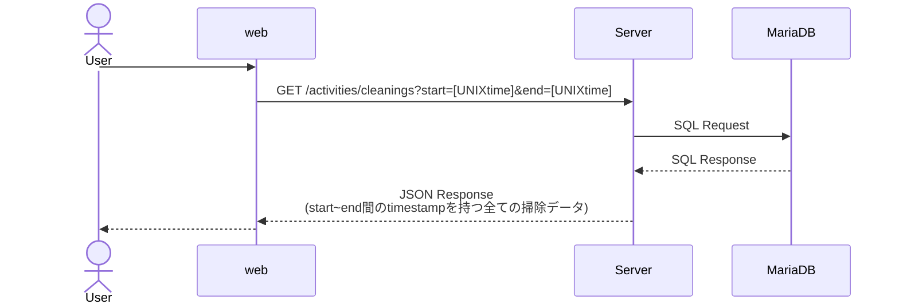

# GetCleaningInfo

```mermaid
sequenceDiagram

actor user as User

participant user
participant web
participant Server
participant MariaDB

user->>web: 
web->>Server: GET /activities/cleanings?start=[UNIXtime]&end=[UNIXtime]
Server->>MariaDB: SQL Request
MariaDB-->>Server: SQL Response
Server-->>web: JSON Response<br>(start~end間のtimestampを持つ全ての掃除データ)
web-->>user: 
```
