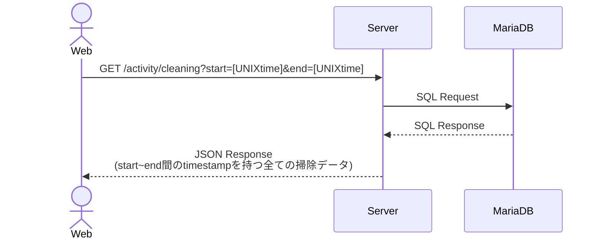

# GetCleaningInfo

```mermaid
sequenceDiagram

actor web as Web

participant web
participant Server
participant MariaDB
web->>Server: GET /activity/cleaning?start=[UNIXtime]&end=[UNIXtime]
Server->>MariaDB: SQL Request
MariaDB-->>Server: SQL Response
Server-->>web: JSON Response<br>(start~end間のtimestampを持つ全ての掃除データ)
```